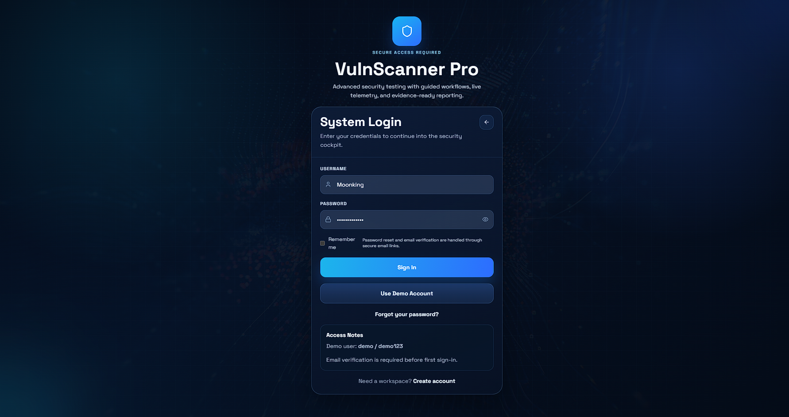
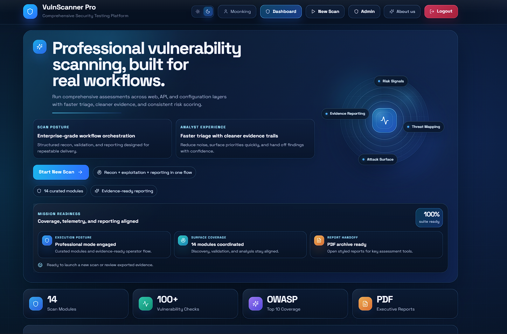
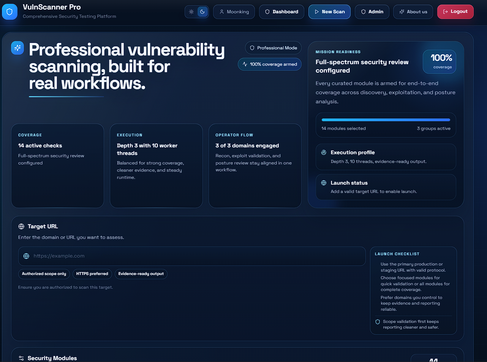
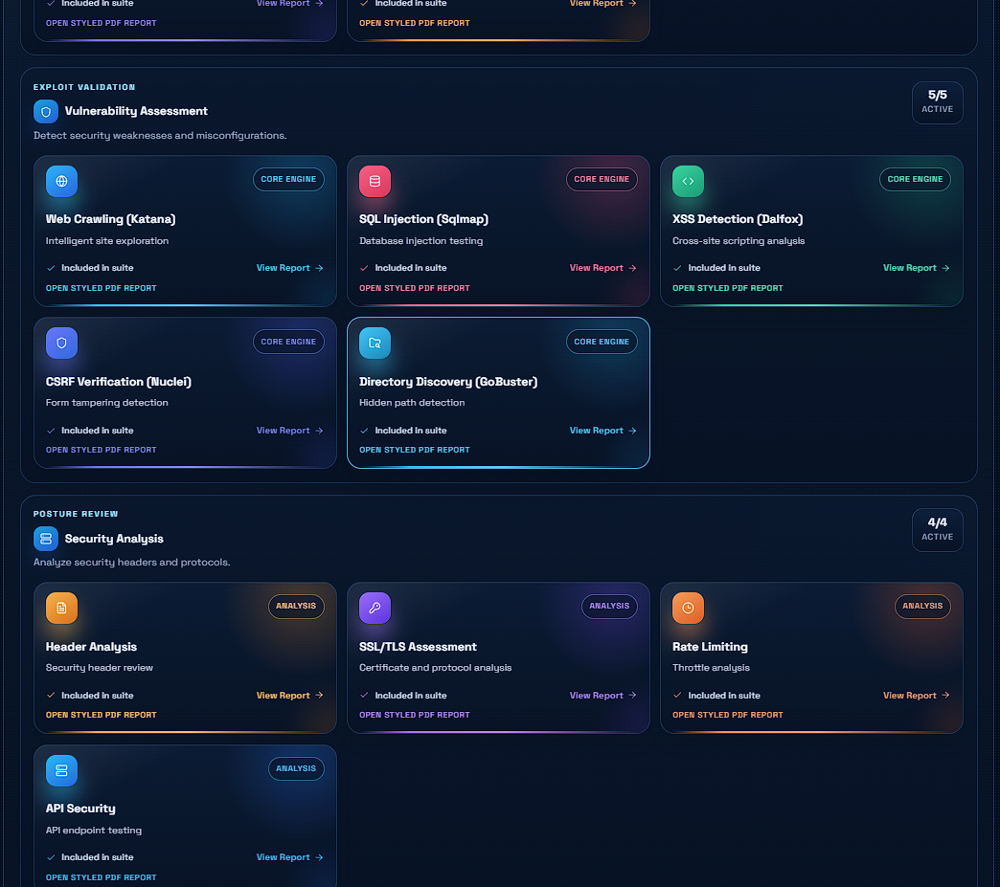
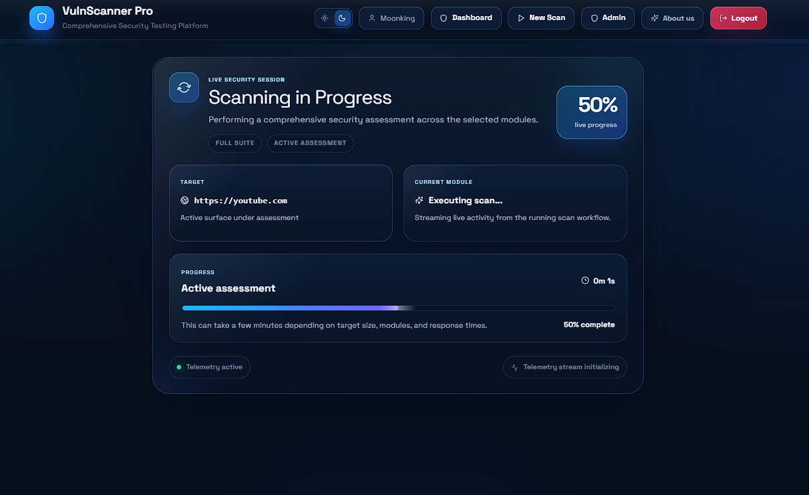
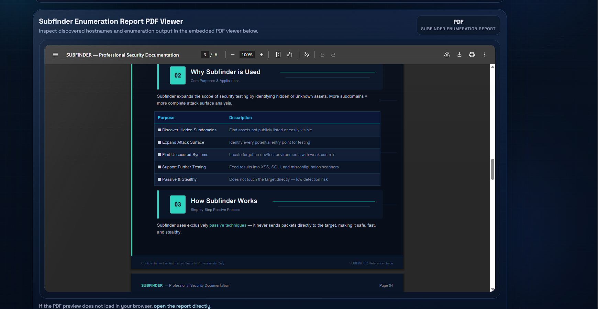
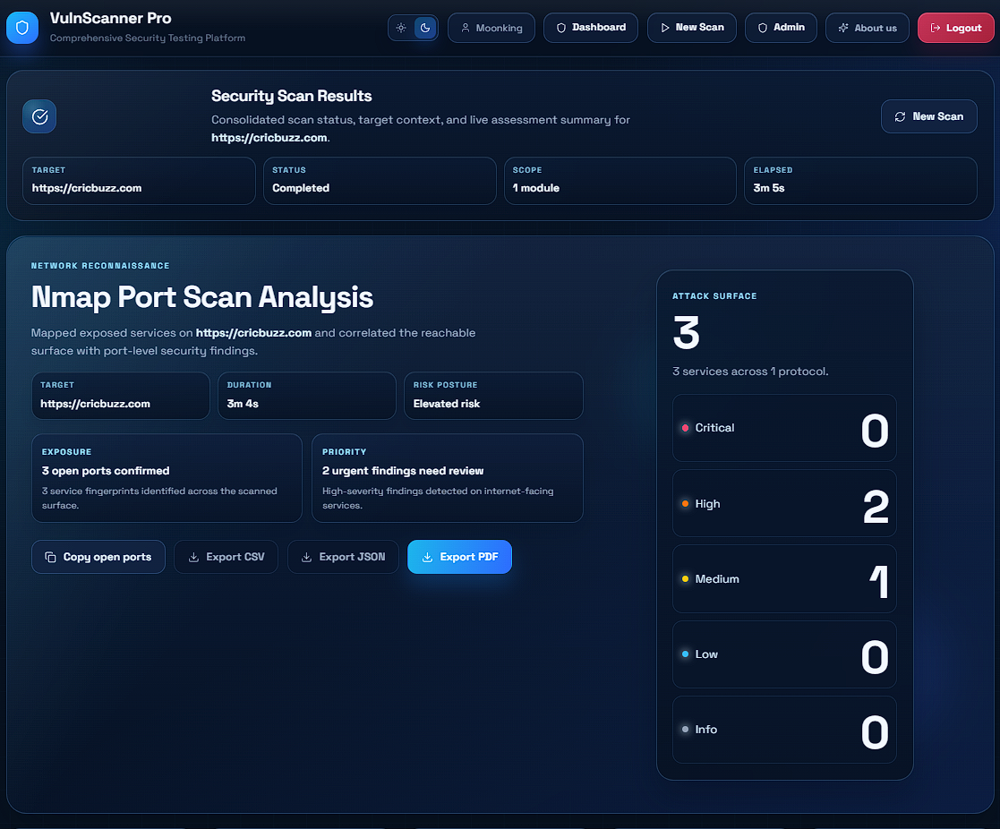
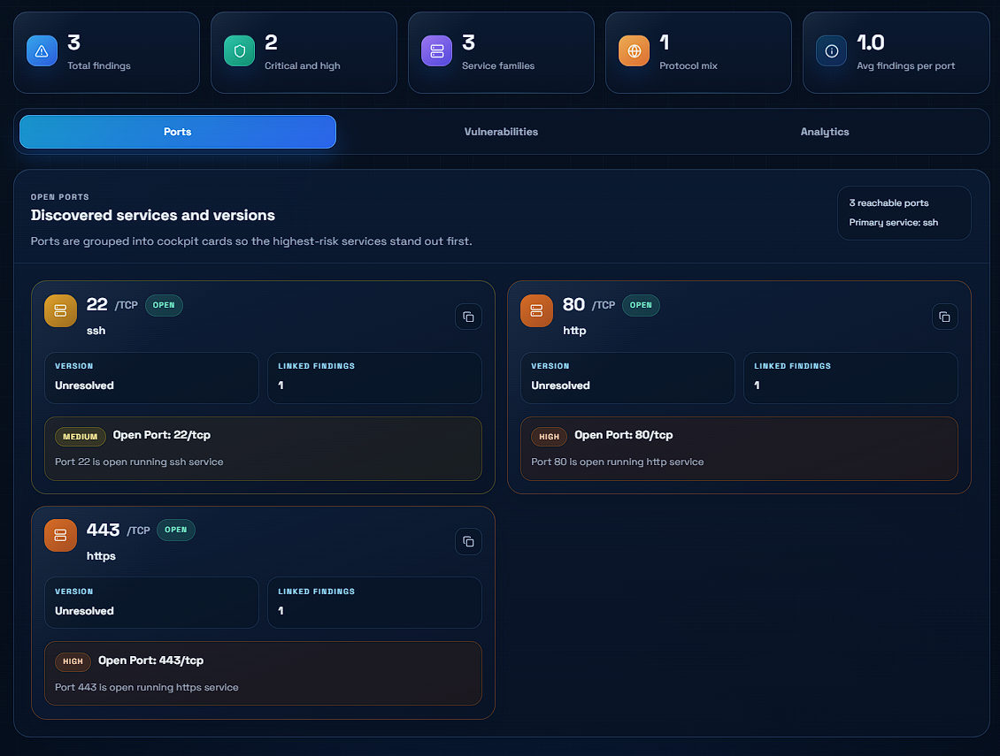

# 🛡️ VulnScanner Pro

A comprehensive security testing platform that automates reconnaissance, vulnerability assessment, security analysis, and report generation through a unified dashboard.

## 🚀 Overview

VulnScanner Pro is a full-stack vulnerability assessment platform designed to streamline security testing workflows. The platform integrates multiple industry-standard security tools into a single interface, enabling users to perform reconnaissance, vulnerability validation, security analysis, and generate professional PDF reports.

> Source code remains private. This repository showcases the platform's features, interface, and reporting capabilities.

---

## ✨ Key Features

- Unified Security Dashboard
- Dark & Light Theme Support
- Real-Time Scan Progress Tracking
- Professional PDF Report Generation
- Tool Documentation Viewer
- Role-Based Access System
- Authentication & Session Management
- Scan History Management
- Administrative Control Panel
- Security-Focused UI/UX

---

## 🔍 Integrated Security Modules

### Reconnaissance
- Nmap
- Subfinder
- Amass
- WhatWeb
- Wayback Analysis

### Vulnerability Assessment
- Katana
- SQLMap
- Dalfox
- Nuclei
- Gobuster

### Security Analysis
- HTTP Header Analysis
- SSL/TLS Assessment
- Rate Limiting Analysis
- API Security Assessment

---

## 📊 Platform Workflow

1. User Authentication
2. Target URL Submission
3. Module Selection
4. Automated Security Assessment
5. Real-Time Progress Monitoring
6. Findings Analysis
7. PDF Report Generation
8. Result Export

---

## 🖼️ Screenshots

### Login Page


### Dashboard Overview


### Scan Configuration


### Security Modules


### Scan Progress


### Documentation Viewer


### Nmap Results Dashboard


### Nmap Open Ports Analysis


---

## 📄 Sample Reports

### Nmap Report
Located in:

```
reports/
```

Sample reports demonstrate the platform's reporting capabilities and evidence-ready output format.

---

## 🛠️ Technology Stack

### Frontend
- React
- TypeScript
- Tailwind CSS

### Backend
- Node.js
- Express.js

### Database
- MongoDB

### Authentication
- JWT Authentication
- Session Management

### Security Tools
- Nmap
- Subfinder
- Amass
- WhatWeb
- Katana
- SQLMap
- Dalfox
- Nuclei
- Gobuster

---

## 🎯 Project Goals

- Centralize security testing workflows
- Simplify vulnerability assessment
- Improve reporting efficiency
- Provide evidence-ready security reports
- Enhance analyst productivity

---

## ⚠️ Disclaimer

This project is intended for educational, research, and authorized security testing purposes only. Users are responsible for ensuring they have proper authorization before scanning any target.

---

## 👨‍💻 Author

Hansal Savaliya

Cybersecurity | SOC | SIEM | VAPT | Full Stack Development

GitHub: https://github.com/hansalsavaliya200-alt
